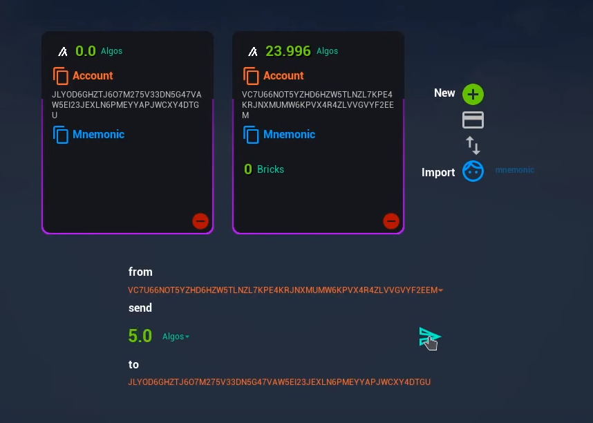

A demo UI in UMG that interacts with Algorand through Unreal Engine

It may be helpful to install UnrealCLR from scratch here https://github.com/nxrighthere/UnrealCLR instead of using the UnrealCLR plugin in this repository.

The demo UI assets are included in the base project and the Algorand BP library is a plugin that relies on UnrealCLR.

See [AlgorandBPLibrary.cpp](Plugins/Algorand/Source/Algorand/Private/AlgorandBPLibrary.cpp) to call or create blueprint functions and [Game.cs](Plugins/Algorand/Source/DotNet/SDK/Game.cs) to implement them via the dotnet-sdk.

This project has not been audited and should not be used in a production environment. Inputs are not verified and exceptions throw with UnrealCLR may cause editor crashes.

This demo was tested using the TestNet. If using MainNet, ensure all API keys and passphrases are kept hidden.

